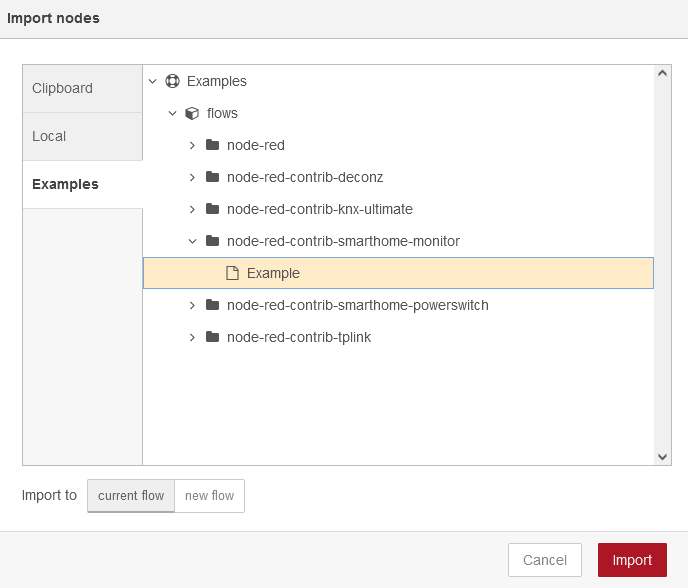
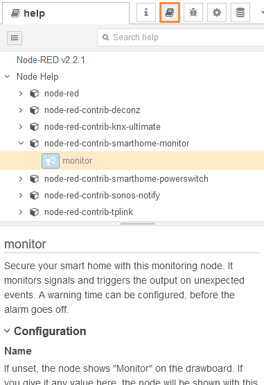

# Description
Secure your smart home with this monitoring node. It monitors signals and triggers the output on unexpected events. A warning time can be configured, before the alarm goes off.

Once installed, the node extends the documentation of Node-RED. Simply open the help in the Node-RED editor and find extended instructions how to use this node.

Basically, you can connect everything on the input. As soon as the node receives any message (no matter if and what topic or message it contains, really every message counts, as long as it does not contain the arming topic), the node will be triggered. If you allow msg.timeout to overwrite the warning time, such message is also excluded from the monitor scope.

The node is able to drop warnings and errors, these can be identified by a unique code. You can find a meaningful explanation of every warning and error in the manual.

# Screenshots

## Configuration

## Connection example

## Import examples

## Manual

## Node status

