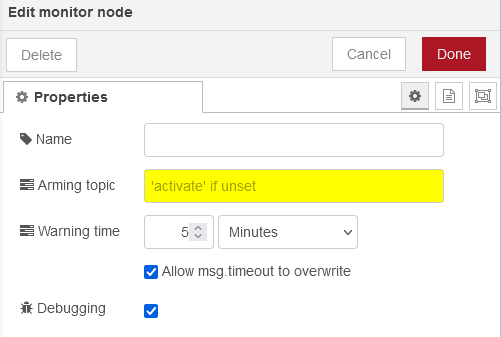

Secure your smart home with this monitoring node. It monitors signals and triggers the output on unexpected events. A warning time can be configured, before the alarm goes off.

# Inputs
## Arming and disarming message
You must send a message with a defined topic. It can be freely configured in the node settings.

If nothing is configured, "activate" as topic is expected. The payload must be:
* boolean `true` to arm
* boolean `false` to disarm

## Signals to monitor
Basically, you can connect everything on the input. As soon as the node receives any message (no matter if and what topic or message it contains, really every message counts, as long as it does not contain the arming topic), the node will be triggered.

# Configuration
## Name
If unset, the node shows "Monitor". If you give any value here, the node will be shown with this string.
## Arming topic
A defined message arms or disarms the node. The message must contain a boolean `true` or `false` to arm or disarm and must contain a defined topic. If this field is left blank, the topic must be "activate".
## Warning time
_That's the time when you open a window but have not disarmed the node until the siren shouts._

When armed, the node watches out for any message on the input (not containing the arming topic). If you have configured a warning time bigger than zero, after a message, the node will send a warning message first. Once the warning time has elapsed, the node will send an alarm message. If you have configured a zero warning time, the node will send an alarm message immediately.

## Allow msg.timeout to verwrite
Together with the TBC
## Debug

# Node status

# Warning and error codes
Warnings and errors will be sent both to the integrated Node-RED debugger and the terminal, so it may be a good idea to have focus to at least one of them. If a warning or an error happens, it will be sent to there with a leading identifier. This starts either with "W" for warnings or "E" for errors. Example: "E007: Invalid James Bond detected, replace!" for an error. Here's the list of codes supported by this individual node:
| Identifier | Description |
| - | - |
| E010 | Warning time unit invalid. In your node configuration, you have to set a timeout value (or use "0" to disable) together with a unit (Seconds, Minutes, Hours). As this unit has to be set from a dropdown, there should not be a way the node receives anything else than one of these. Anyways, the unit will be checked and if, for some weird reason, it is not one of those selectable, you will see this error. Get in touch with the developer to get that fixed.