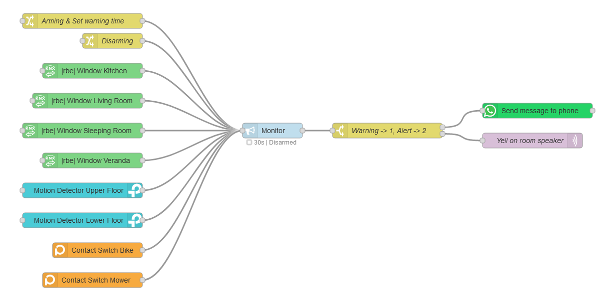

Secure your smart home with this monitoring node. It monitors signals and triggers the output on unexpected events. A warning time can be configured, before the alarm goes off.

# Examples
Once installed, in Node-RED, open the menu and choose "Import". Under "Examples", you will find some examples you can easily import. You may start with one of those.

# Inputs and outputs
Once installed, the node extends the documentation of Node-RED. Simply open the help in the Node-RED editor and find extended instructions how to use this node.

## Example: Arm
`msg.topic = "activate", msg.payload = true`

Code snippet

    [{"id":"7d68278729e636f7","type":"inject","z":"e2a61a0d9172bf79","name":"arming","props":[{"p":"payload"},{"p":"topic","vt":"str"}],"repeat":"","crontab":"","once":false,"onceDelay":0.1,"topic":"activate","payload":"true","payloadType":"bool","x":210,"y":80,"wires":[["e229b4460974fd76"]]}]

## Example: Disarm
`msg.topic = "activate", msg.payload = false`

Code snippet

    [{"id":"7d68278729e636f7","type":"inject","z":"e2a61a0d9172bf79","name":"arming","props":[{"p":"payload"},{"p":"topic","vt":"str"}],"repeat":"","crontab":"","once":false,"onceDelay":0.1,"topic":"activate","payload":"false","payloadType":"bool","x":210,"y":80,"wires":[["e229b4460974fd76"]]}]

## Overwrite warning time
The value must be a number and given in miliseconds. The message must look like `msg.timeout = number in ms`. If you set the warning time to zero, no warning time is set and the alarm will be triggered immediately. If you want to reset to the value configured in the node, send a negative value.

### Example: Set a 30 seconds warning time
`msg.timeout = 30000`

Code snippet

    [{"id":"e84a0e849b462266","type":"inject","z":"e2a61a0d9172bf79","name":"timeout:5000","props":[{"p":"timeout","v":"30000","vt":"num"}],"repeat":"","crontab":"","once":false,"onceDelay":0.1,"topic":"","x":230,"y":360,"wires":[["e229b4460974fd76"]]}]

### Example: Set zero warning time
`msg.timeout = 0`

Code snippet

    [{"id":"e84a0e849b462266","type":"inject","z":"e2a61a0d9172bf79","name":"timeout:5000","props":[{"p":"timeout","v":"0","vt":"num"}],"repeat":"","crontab":"","once":false,"onceDelay":0.1,"topic":"","x":230,"y":360,"wires":[["e229b4460974fd76"]]}]

### Example: Set warning time to node configuration
`msg.timeout = -1`

Code snippet

    [{"id":"e84a0e849b462266","type":"inject","z":"e2a61a0d9172bf79","name":"timeout:5000","props":[{"p":"timeout","v":"-1","vt":"num"}],"repeat":"","crontab":"","once":false,"onceDelay":0.1,"topic":"","x":230,"y":360,"wires":[["e229b4460974fd76"]]}]

## Signals to monitor
Basically, you can connect everything on the input. As soon as the node receives any message (no matter if and what topic or message it contains, really every message counts, as long as it does not contain the arming topic), the node will be triggered.

Note: If you allow msg.timeout to overwrite the warning time, such message is also excluded from the monitor scope.

# Node status

# Warning and error codes
Warnings and errors will be sent both to the integrated Node-RED debugger and the terminal, so it may be a good idea to have focus to at least one of them. If a warning or an error happens, it will be sent to there with a leading identifier. This starts either with "W" for warnings or "E" for errors. Example: "E007: Invalid James Bond detected, replace!" for an error. Here's the list of codes supported by this individual node.

## Warnings (Wxxx)
| Identifier | Short description | Extended description |
| - | - | - |
| W010 | Arming payload invalid | The node received a message containing the arming topic. Such a message must contain either boolean `true` to arm or `false` to disarm. The payload was neither of those, which results in that warning. Make sure that your arming message contains a valid payload. |

## Errors (Exxx)
| Identifier | Short description | Extended description |
| - | - | - |
| E010 | Warning time unit invalid | In your node configuration, you have to set a timeout value (or use "0" to disable) together with a unit (Seconds, Minutes, Hours). As this unit has to be set from a dropdown, there should not be a way the node receives anything else than one of these. Anyways, the unit will be checked and if, for some weird reason, it is not one of those selectable, you will see this error. Get in touch with the developer to get that fixed.